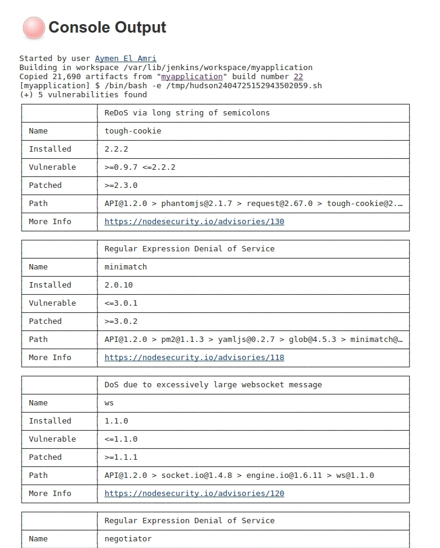

# nodeSS : Node.js Security Scanner

This container will scan your Nodejs code for dependency vulnerabilities usinf nsp, print the result and exits.
You can find the container on Docker Hub : https://hub.docker.com/r/eon01/nodejs-security-scanner/


<p align="center">
  
</p>


# How To

Download your Node.js code to a folder and execute the docker container within the source code folder:

```
cd app/
docker run -it --rm  --name nsp-security-check -v "$PWD":/usr/src/app  eon01/nodejs-security-scanner:1.0
```

This is an output example:

```
docker run -it --rm  --name nsp-security-check -v "$PWD/code":/usr/src/app  eon01/nodejs-security-scanner:1.0
Unable to find image 'eon01/nodejs-security-scanner:1.0' locally
1.0: Pulling from eon01/nodejs-security-scanner
357ea8c3d80b: Already exists 
52befadefd24: Already exists 
3c0732d5313c: Already exists 
ceb711c7e301: Already exists 
868b1d0e2aad: Already exists 
539fff81aa52: Already exists 
d12b34ef0311: Pull complete 
Digest: sha256:4b652c5aa023c2417b412e6f57ecfc2f35dfc26d8c168dfbaff5410308b7e0a9
Status: Downloaded newer image for eon01/nodejs-security-scanner:1.0
(+) 5 vulnerabilities found
┌───────────────┬──────────────────────────────────────────────────────────────────────┐
│               │ ReDoS via long string of semicolons                                  │
├───────────────┼──────────────────────────────────────────────────────────────────────┤
│ Name          │ tough-cookie                                                         │
├───────────────┼──────────────────────────────────────────────────────────────────────┤
│ Installed     │ 2.2.2                                                                │
├───────────────┼──────────────────────────────────────────────────────────────────────┤
│ Vulnerable    │ >=0.9.7 <=2.2.2                                                      │
├───────────────┼──────────────────────────────────────────────────────────────────────┤
│ Patched       │ >=2.3.0                                                              │
├───────────────┼──────────────────────────────────────────────────────────────────────┤
│ Path          │ API@1.2.0 > phantomjs@2.1.7 > request@2.67.0 > tough-cookie@2.2.2    │
├───────────────┼──────────────────────────────────────────────────────────────────────┤
│ More Info     │ https://nodesecurity.io/advisories/130                               │
└───────────────┴──────────────────────────────────────────────────────────────────────┘
┌───────────────┬──────────────────────────────────────────────────────────────────────┐
│               │ Regular Expression Denial of Service                                 │
├───────────────┼──────────────────────────────────────────────────────────────────────┤
│ Name          │ minimatch                                                            │
├───────────────┼──────────────────────────────────────────────────────────────────────┤
│ Installed     │ 2.0.10                                                               │
├───────────────┼──────────────────────────────────────────────────────────────────────┤
│ Vulnerable    │ <=3.0.1                                                              │
├───────────────┼──────────────────────────────────────────────────────────────────────┤
│ Patched       │ >=3.0.2                                                              │
├───────────────┼──────────────────────────────────────────────────────────────────────┤
│ Path          │ API@1.2.0 > pm2@1.1.3 > yamljs@0.2.7 > glob@4.5.3 > minimatch@2.0.10 │
├───────────────┼──────────────────────────────────────────────────────────────────────┤
│ More Info     │ https://nodesecurity.io/advisories/118                               │
└───────────────┴──────────────────────────────────────────────────────────────────────┘
┌───────────────┬──────────────────────────────────────────────────────────────────────┐
│               │ DoS due to excessively large websocket message                       │
├───────────────┼──────────────────────────────────────────────────────────────────────┤
│ Name          │ ws                                                                   │
├───────────────┼──────────────────────────────────────────────────────────────────────┤
│ Installed     │ 1.1.0                                                                │
├───────────────┼──────────────────────────────────────────────────────────────────────┤
│ Vulnerable    │ <=1.1.0                                                              │
├───────────────┼──────────────────────────────────────────────────────────────────────┤
│ Patched       │ >=1.1.1                                                              │
├───────────────┼──────────────────────────────────────────────────────────────────────┤
│ Path          │ API@1.2.0 > socket.io@1.4.8 > engine.io@1.6.11 > ws@1.1.0            │
├───────────────┼──────────────────────────────────────────────────────────────────────┤
│ More Info     │ https://nodesecurity.io/advisories/120                               │
└───────────────┴──────────────────────────────────────────────────────────────────────┘
┌───────────────┬──────────────────────────────────────────────────────────────────────┐
│               │ Regular Expression Denial of Service                                 │
├───────────────┼──────────────────────────────────────────────────────────────────────┤
│ Name          │ negotiator                                                           │
├───────────────┼──────────────────────────────────────────────────────────────────────┤
│ Installed     │ 0.4.9                                                                │
├───────────────┼──────────────────────────────────────────────────────────────────────┤
│ Vulnerable    │ <= 0.6.0                                                             │
├───────────────┼──────────────────────────────────────────────────────────────────────┤
│ Patched       │ >= 0.6.1                                                             │
├───────────────┼──────────────────────────────────────────────────────────────────────┤
│ Path          │ API@1.2.0 > socket.io@1.4.8 > engine.io@1.6.11 > accepts@1.1.4 > ne… │
├───────────────┼──────────────────────────────────────────────────────────────────────┤
│ More Info     │ https://nodesecurity.io/advisories/106                               │
└───────────────┴──────────────────────────────────────────────────────────────────────┘
┌───────────────┬──────────────────────────────────────────────────────────────────────┐
│               │ DoS due to excessively large websocket message                       │
├───────────────┼──────────────────────────────────────────────────────────────────────┤
│ Name          │ ws                                                                   │
├───────────────┼──────────────────────────────────────────────────────────────────────┤
│ Installed     │ 1.0.1                                                                │
├───────────────┼──────────────────────────────────────────────────────────────────────┤
│ Vulnerable    │ <=1.1.0                                                              │
├───────────────┼──────────────────────────────────────────────────────────────────────┤
│ Patched       │ >=1.1.1                                                              │
├───────────────┼──────────────────────────────────────────────────────────────────────┤
│ Path          │ API@1.2.0 > socket.io@1.4.8 > socket.io-client@1.4.8 > engine.io-cl… │
├───────────────┼──────────────────────────────────────────────────────────────────────┤
│ More Info     │ https://nodesecurity.io/advisories/120                               │
└───────────────┴──────────────────────────────────────────────────────────────────────┘
```


# Getting A JSON Output

```
docker run -it --rm  --name nsp-security-check -v "$PWD":/usr/src/app -e OUTPUT='json'  eon01/nodejs-security-scanner:1.0
```

# Integrating A Security Test In Your Jenkins CI

You can easily integrate this into your Jenkins CI pipeline. 

- Install Docker in your Jenkins server.
- Add Jenkins to Docker group:

```
sudo usermod -aG docker jenkins
```

And add a simple shell script to your Jenkins job:

```
#!/bin/bash -e
docker run  --rm  --name nsp-security-check -v "$PWD":/usr/src/app  eon01/nodejs-security-scanner:1.0
```
If one vulnerability is found the execution will return 1 otherwise 0:

```
docker run -it --rm --name nsp-security-check -v /home/ubuntu/test/:/usr/src/app/ eon01/nodejs-security-scanner:1.0
(+) No known vulnerabilities found
```

Output:

```
root@myserver:/tmp# echo $?
0
```



# Credits

nodejs-security-scanner image uses:

- Docker : https://github.com/docker/docker
- nsp : https://github.com/nodesecurity/nsp
